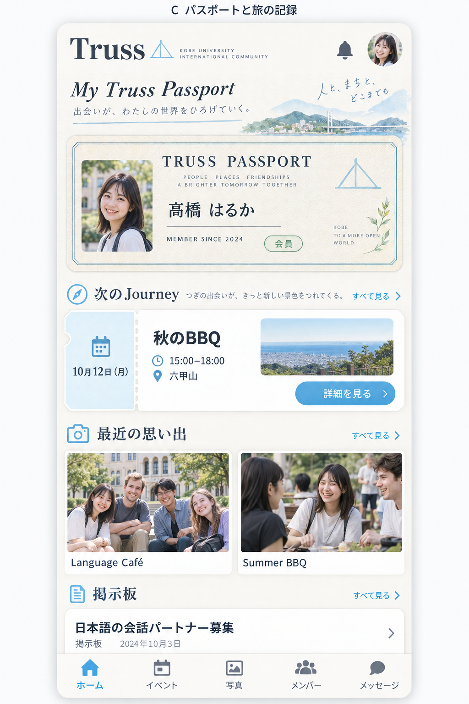

# PWA版のパスポートとジャーナル設計

2026-10-05。C案を軸に、ネイティブ版のリリースに先行して、一般メンバー向けPWAにPassport・Journey・Memoriesの世界観を取り入れる。ホームで自分の所属を感じられ、次のイベントへ直接進め、活動の記録を見返せる構成を目指す。

C案の方向性、現在の5タブを維持して専用ブランチで調整する方針はユーザーの承認済み。段階1〜3を `codex/pwa-passport-design` で実装し、段階4は今後の機能設計として残す。

追加のデザイン変更はブランチとプレビューで調整し、ユーザーが完成版を確認して本番公開を明示的に指示した後にmainへ統合する。途中の実装完了や検証成功を公開承認として扱わない。

## 参考画像と実装する構成



画像は生成した探索案。人物・写真・イベント情報はサンプルで、実装では既存の会員情報と活動写真を使う。画像に含まれる大きな見出しやスローガンを縮め、スマホの最初の画面内に次のイベントの操作を収める。画像の「メンバー」タブに相当する位置は、現在のPWAでは「掲示板」である。

## 初期導入の範囲

まずホームと会員向け共通シェル（ヘッダー・下部ナビ・配色・文字・ダイアログ）を整える。続いてイベント・写真・掲示板の画面へ展開する。運営画面は専用の操作密度を維持し、会員向けの装飾や配色変更が波及しないようテーマを分ける。

既存データで表示できる内容を先行させる。スタンプ、Connections、BLE/NFC、恒久的な入会年、独立したPassportページは後続の機能設計として扱う。参加登録・会費・承認の条件は既存の処理を使う。

## ホームの情報構成

通常の承認済み会員では、以下の順序にする。

```text
┌──────────────────────────────────┐
│ Truss        言語  通知  プロフィール │
├──────────────────────────────────┤
│ Truss Passport                   │
│ 写真  名前                       │
│ 会員状態             会員情報へ    │
├──────────────────────────────────┤
│ 次のJourney                      │
│ 日付   イベント名                  │
│        時間・会場                  │
│        申込済み表示   詳細を見る     │
├──────────────────────────────────┤
│ 最近の思い出           すべて見る    │
│ 活動写真               活動写真    │
│ イベント名             イベント名   │
├──────────────────────────────────┤
│ 掲示板                 すべて見る    │
│ 運営のお知らせ・募集の見出し         │
├──────────────────────────────────┤
│ ホーム / イベント / ギャラリー / 掲示板 │
│ メッセージ                        │
└──────────────────────────────────┘
```

### パスポート

ホームでは表紙に相当する小さな会員カードとして見せる。写真・名前・会員状態と、必要な会員年度を載せ、カードのタップで既存のプロフィールへ進む。写真がない場合は既存のイニシャル表示を使う。学籍番号・メール・電話などはプロフィール側にまとめる。

ロゴだけの大きなカードと裏返し操作から、本人の情報が最初から見える構成へ変える。橋のモチーフ、細い罫線、紙の余白がパスポートらしさを担う。最初の導入で新しいパスポート番号を発行したように見せる表示は加えない。

### 次のJourney

開催予定のうち、当日以降で最も近いイベントを1件表示する。同日は開始時刻順に選ぶ。日付・イベント名・時間・会場を常時表示し、画像未設定でも成立するチケット型のレイアウトにする。選択されたイベントへの申込がある場合だけ「申し込み済み」を付ける。

「詳細を見る」またはチケットのタップで、既存のイベント詳細を直接開く。参加・キャンセル・LINEグループへの導線は詳細に集約する。「参加する」が即時登録なのか確認画面なのかを、ホーム側の装飾で曖昧にしない。現在追加済みの直接詳細を開く動作を維持する。

初期段階の下部タブは「イベント」、ホームの章見出しは「次のJourney」とする。イベント名・日付・詳細ボタンが内容を伝え、常設の説明文は加えない。

### 最近の思い出

承認済みの活動写真をイベント単位でまとめ、スマホでは2件、広い画面では最大3件見せる。同じイベントの写真で全枠が埋まらないようにする。イベント開催日を主な並び順とし、同日の場合は写真投稿日を使う。写真の下にはイベント名と開催日だけを置く。

初期版はコミュニティで共有された写真を対象にする。個人の参加履歴との紐付けがない写真を「自分の記録」とは表現しない。「すべて見る」で既存のギャラリーへ進む。写真タップから対象写真を直接開く動作は、ギャラリーに対象IDを渡す設計と合わせて追加する。

### 掲示板

公開中の掲示板投稿から最大2件を表示する。ピン留め順、運営のお知らせ、新しい投稿の順を既存の表示規則と揃える。非表示・削除済み・期限切れの投稿は除外し、ストーリーはホームのプレビューに含めない。

ホームでは見出し・発信者・日付を中心にし、本文の長文表示や返信は既存の掲示板へ任せる。投稿から対象の掲示板カードへ移り、必要なら全文を展開する。「すべて見る」は一覧へ進む。

## 会員状態と空状態

| 状態 | ホームの見せ方 |
| --- | --- |
| 通常の承認済み会員 | パスポート、次のJourney、思い出、掲示板を表示 |
| 承認待ち | パスポートに承認待ちを表示し、既存の閲覧権限を維持。運営への連絡を残す |
| 会費未納・プロフィール未完了 | 次に必要な手続きを短い1つの案内に集約。既存の参加制限はイベント詳細で適用 |
| 次のイベントがない | 「次のイベントは準備中」とイベント一覧へのリンク。架空の予定や空チケットを置かない |
| 写真がない | 思い出の章を小さくし、承認済み会員には「写真を投稿」へ進む操作を用意 |
| 掲示板投稿がない | 章を縮め、掲示板一覧への入口を残す |
| 読み込み中 | 領域の寸法を保ったプレースホルダー。未取得を「0件」と見せない |
| 取得失敗 | 取得できなかった章にだけ短い状態と再試行を表示。パスポートや他の章は使える状態を保つ |

現在は複数の案内がホームの先頭に並ぶ。初期登録・年度更新・学生証の再提出など、判断に必要な案内を先に残し、任意のプロフィール補足・通知許可・PWA追加案内は同時に大きく積み上げない。単純なCSS変更で案内を消さず、各状態の復帰操作を保ったまま優先順位を整理する。

## 共通デザイン

パレットと文字の役割は、既存のネイティブ側の `apps/mobile/src/constants/theme.ts` に合わせる。

| 用途 | 色・仕様 |
| --- | --- |
| ページ背景 | Cream `#F7F5F1` |
| 紙面・ダイアログ | White `#FFFFFF` |
| 基本文字 | Navy `#3D4756` |
| ブランド・チケットの色面 | Blue `#6DB9E7` |
| 会員状態の補助色 | Sage `#B7D8C1` |
| 思い出・補助装飾 | Peach `#F3C7B6` |
| 罫線 | `#E4DFD5` |
| 小さな補助文字 | `#626A76` |
| 操作ボタン・リンク | 濃いBlue `#236B94`。塗りボタンは白文字 |

ブランドBlueに白い通常サイズの文字を置くとコントラストが約2.16:1になるため、主要ボタンには濃いBlueを使う（白文字で約5.83:1）。色面と操作色を分け、選択・エラー・未読は文字や形でも識別できるようにする。

- 英字のブランド・Passport見出しはPlayfair Display、日本語と操作文はNoto Sans JP。手書き文字はロゴ周辺の小さなアクセントに限定する。
- 本文16px、補助情報14px、章見出し18〜20pxを目安にする。長いイベント名・会員名・英語でも折り返す。
- 間隔は4・8・16・24・32pxを基本にする。角丸は紙面12px、入力・ボタン8px、状態バッジのみ円形に寄せる。同じカード装飾で全章を囲わず、思い出と掲示板は紙面の流れに馴染ませる。
- 水彩の橋・神戸の風景は静的な装飾として1画面の一箇所を目安にし、文字・写真・操作の上に重ねない。茶色い革や過度な古紙表現は採用しない。
- UIアイコンはFont Awesomeを使う。写真・水彩イラスト・橋のブランド図形と、操作用アイコンの役割を分ける。
- 自動横スクロールのイベントバナーは、固定の次のJourneyとイベント一覧への入口へ整理する。操作への応答以外の常時アニメーションは加えない。
- 会員向けテーマはラッパー内へ適用し、管理画面の既存トークンを一括置換しない。ダイアログなどのPortalにも会員テーマが届く境界を設計する。

## スマホと広い画面

通常会員の390×844px表示では、ヘッダー・パスポート・次のJourneyの詳細ボタンまでを最初の画面に収める。320×568pxでも同じ操作を収めるため、スマホの表紙カードは高さ約140〜160px、イベントチケットは約160〜180pxを目安にする。長いタイトルや文字拡大時には自然に縦へ伸ばし、内容を切り捨てない。

スマホは左右16px・1カラム。広い画面では本文幅を約1040pxに抑え、左の約320pxにパスポート、右に次のJourney・思い出・掲示板を置く。上から下へ読む意味順はスマホと一致させる。

下部ナビの安全領域を確保し、最後の投稿やボタンが隠れないようにする。フォームは画面高に上限を持つスクロール可能な紙面にし、掲示板の長文対策を維持する。押せる領域は約44px以上、フォーカスを可視化し、文字拡大・キーボード表示・動きを減らす設定も確認する。

## タブと名称の段階移行

初期導入では、現在の5タブの役割を保ち、「ホーム / イベント / ギャラリー / 掲示板 / メッセージ」とする案を推奨する。現行の「メッセジ」の表記は「メッセージ」に整える。プロフィールから会員情報への入口を保つ。メンバー一覧は現在の5タブには含まれておらず、画像の構成だけで掲示板をメンバー一覧に置き換えない。

別案は「ホーム / イベント / 思い出 / 掲示板 / Passport」とし、運営チャットをヘッダーの「運営に相談」へ移す。この場合は未読バッジと通知からの復帰、プロフィール編集・会員証を含むPassportページを先に用意する必要がある。今回は現在の5タブを維持する方針が承認済み。この別案は将来の検討事項とする。

将来のネイティブ版の「Home / Journey / Memories / Connections / Passport」は既存計画を維持する。Connectionsは出会いの記録であり、掲示板やメンバー名簿の単なる改名ではない。PWAにも対応機能が揃った段階で、掲示板・運営相談の入口と合わせて移行する。

## 表示データの意味

| 表示 | 既存データ | 設計上の扱い |
| --- | --- | --- |
| 名前・顔写真・役割 | `User.name` / `avatarPath` / `role` | 既存表示と署名付き画像URLの取得を使う |
| 会員年度 | `User.membershipYear` | 会費確認時に更新される年度。「入会年」「Member since」とは表示しない |
| 登録日 | `User.createdAt` | 現在のクエリ・マッパーで取得できる。アプリの登録日であり、過去からの所属開始日とは区別する |
| 次のイベント | `Event.date` / `time` / `status` | ローカル日付で開催予定を選択し、詳細を直接開く |
| 申し込み済み | `attendingEvents` | 選ばれたイベントIDへの登録状態。出席済みの意味では使わない |
| 思い出 | `GalleryPhoto.approved` / `eventId` / `eventDate` / `uploadedAt` | 承認済み写真だけをイベント単位で表示 |
| 掲示板プレビュー | `BoardPost`と既存の期限判定 | 公開状態・期限・ピン順を一覧と共通化する |
| 将来の参加記録 | `EventParticipant.attended` | 申込だけではスタンプを付けない。記録の条件と旧データの扱いを別途決める |

ホームは最初の段階で新しいDB項目を要求しない。恒久的な所属開始日やスタンプを加える場合は、別のデータ設計として扱う。

## 実装の分割案

| 段階 | 変更する内容 | 完了の判断 |
| --- | --- | --- |
| 1 ホームと共通シェル | 会員向けトークン、ヘッダー・ナビ、パスポート表紙、次のJourney、案内の優先順位 | 通常会員と手続き中の画面で主要操作が成立し、直接イベント詳細を開ける |
| 2 思い出と掲示板 | ホームに写真・投稿プレビューを追加。対象写真・投稿への直接遷移を整える | 表示権限・空状態・読込失敗・長文を確認し、対象コンテンツへ到達できる |
| 3 各画面の統一 | イベント・ギャラリー・掲示板・プロフィール・運営相談へ同じ文字と紙面を展開 | カレンダー、参加登録、投稿、プロフィール編集、会費・相談の既存フローが通る |
| 4 Passportの拡張 | 独立ページ・実際の参加記録・入会時期・タブ構成の整理 | 表示する記録の意味とデータの扱いが確定してから着手 |

画面に閉じる要素は `apps/web/src/components/member/` にまとめ、既存Dashboardから段階的に使う。パスポート表紙・イベントチケット・思い出一覧・掲示板プレビューを分ける。汎用プリミティブの追加が必要な場合は `~/Developer/packages/ui` の原本から配布する。

選択・集計・公開可否の純粋な処理をネイティブでも使う場合は `@truss/core` にまとめる。WebのTailwindやRadixをネイティブに持ち込まず、色・文字の役割・文言・情報の順序を共有する。認証の `storageKey: 'truss-app-auth'` を維持する。

## 検証と今後の確認

- 下部タブは現行の5つを維持。メッセージの表記も修正済み。
- 神戸・六甲・橋をモチーフに水彩を制作し、パスポートの情報と重ならない下部に配置。既存のロゴと活動写真を使用。素材は [制作記録](./design/pwa-assets.md) を参照。
- 通常会員、承認待ち、学生証再提出、会費未納、更新手続き、プロフィール未完了、0件・過去のみ・当日・読込中・取得失敗の画面をブラウザで検証済み。
- 320×568・390×844・1280×800、日英、200%文字拡大、動きを減らす設定、ダイアログ、standaloneメディア条件を検証済み。イベント・写真・対象投稿への直接遷移、プロフィール編集、運営相談、会費案内、学年確認も確認。長文貼り付けは会員・運営とも104,400文字で全量送信コールバックまで確認した（テストデータのみ、実DBには未投稿）。
- 型チェックと本番ビルドが成功。変更対象のLintは既存10エラーがあり、変更前と比較して追加エラーなし。
- iOS・Androidのインストール済みPWAにおける起動・キーボード・安全領域の実機確認は今後の確認事項。

関連資料: [世界観](./design-concept.md)、[移行計画](./plan.md)、[進捗](./tasks.md)。

次の更新: [会員証・参加チケット・QR受付](./pwa-member-checkin.md)、[SVG素材仕様](./design/pwa-svg-brief.md)、[部活・イベント企画メモ](./community-ideas.md)。

## ガラス表現の試作は取り下げ

2026-10-05。ユーザーの確認により、薄いガラスの下部ナビ・操作ボタンの試作は採用しない。ナビと操作ボタンは試作前の表示へ戻し、紙とパスポートの世界観を継続する。試作時に見つけたホーム英語表示の横へのはみ出し修正は維持する。
