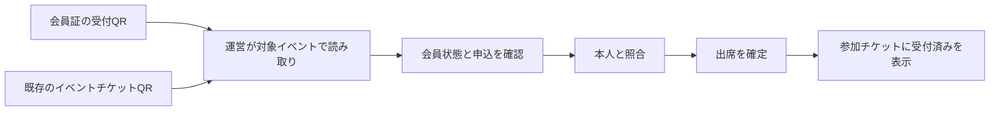

# 会員証・参加チケット・QR受付

2026-10-05。C案のパスポートとジャーナルを、会員証・参加チケット・写真の紙面へ展開する。次段階のブランチは `codex/pwa-member-checkin`。QRの将来の必須化は、ユーザー確認により「当日の受付でQRを読み取り、出席を確定する」方向とする。

このブランチはプレビューで調整する。ユーザーから本番公開の明示的な指示があるまでmainへの統合・本番公開を行わない。

## 画面と操作

- ホームの会員カードは名前・状態・会員年度を維持し、会員情報と「会員証QR」を独立した操作にする。
- 会員証は「表 / 受付QR」の切り替え。裏面は白地のQR、本人名、Truss Passport。QRへ写真・装飾・ロゴを重ねない。承認待ち・利用停止中はQRを表示しない。
- イベント詳細の申込済み情報は参加チケットとして表示する。名前、日時、会場、地図、申込／受付の状態、顔写真の掲載拒否、会員証QRへの入口を載せる。参加費・説明・登録／キャンセルの処理は既存を使う。
- 運営はイベント詳細で「QR受付」を開く。対象イベントと日付を固定表示し、「カメラで読み取る」を押してカメラ権限を求める。別イベントへ自動で受付先を切り替えない。
- 読み取り後に会員・申込情報を再取得し、本人名・プロフィール写真・顔写真掲載拒否を表示。「出席を確定」で保存する。本人との照合に必要な案内だけを置く。
- 不明なQR、別イベント、申込なし、未承認・利用停止、取得失敗、保存失敗を短く表示。受付済みは再確定させない。開催日が当日でない場合は警告するが、運営による事後受付は可能とする。
- 読み取り完了・停止・画面を閉じるとカメラを止める。カメラ非対応・拒否・通信失敗の場合は既存の参加者一覧による受付へ戻れる。

## 既存実装との接続

ネイティブ版には `EventTicket.tsx` と `CheckinScannerScreen.tsx` がある。イベントQRは `truss-checkin:v1:{eventId}:{userId}`。PWAの運営受付はこの形式にも対応し、選択中のイベントと一致する場合だけ受け付ける。

新しい会員QRは `truss-member:v1:{userId}`。氏名・メール・学生番号・認証トークンを含めない。UUIDの形式とバージョンを検証し、共通ロジックを `@truss/core` に置く。会員QRのネイティブ受付側対応は後続作業で、既存のネイティブ用イベントQRは継続して使用できる。

出席の保存は既存の `confirmEventAttendance()` を使う。UPDATE後の行を取得し、権限不足や申込取消で更新0件になった場合も失敗として扱う。運営一覧には保存成功後にだけ受付済みを反映する。DBスキーマと参加申込みの条件は初期導入で変更しない。

本番DBの `event_participants` について、RLSの有効化、管理者のみUPDATEできるポリシーと、管理者または承認済み本人に限定したSELECTポリシーを読み取りで確認した。新しい受付画面もログイン中のクライアントと既存RLSを使う。参加者一覧の従来のチェックボックス保存でも、UPDATE後の0件を失敗として扱う。

会員QRは複製でき、本人であることを暗号的に証明するものではない。今回の受付では運営が表示された本人情報を照合する。QR自体は出席を更新する権限を持たない。

使用ライブラリ: [qrcode.react](https://github.com/zpao/qrcode.react)（SVG生成）、[ZXing Browser](https://github.com/zxing-js/browser)（カメラ読み取り）。デコーダはカメラ開始時に読み込む。ZXingはリポジトリのNode 20/22系にも対応するバージョンを採用する。

## 将来の必須化

最初はQR受付を補助として導入し、従来の参加者一覧からの受付を残す。申込み済みは予約、受付済みは当日の出席として区別する。申込みだけで出席スタンプを付けない。

必須化の段階では、以下を別途実装する。

- イベントごとの受付方針（任意／QR必須）をサーバー側に保存する。
- 受付時刻・受付した運営・QR／手動の経路・例外理由を記録する。現在の `attended` 真偽値だけではQRを通ったかを区別できない。
- QR必須のイベントで、従来のチェックボックス更新が条件を迂回しないよう、DB側の受付処理と権限も揃える。
- カメラ故障・スマホを持たない会員・通信断の受付方法を決め、運営による例外と理由を記録する。
- 固定QRの複製を許容する対面確認か、短時間有効のQRを追加するかを決める。必須化が本人認証の強化までを意味するかは別の判断とする。

## 写真と素材

ホームの活動写真を、白い小さな紙枠に写真・イベント名・開催日をまとめる構成へ揃える。既存の承認済み写真の範囲と、対象写真への直接遷移を維持する。写真はSVG化せず実写真を使う。

掲示板は投稿者・種別・返信欄をカード全幅で表示し、カード内部の幅が520px以上の場合だけ画像と本文を横に並べる。狭いカードは縦に並べ、画像は切り取らず表示する。お知らせの種別ラベルは日本語を途中で折らず、英語は必要なら単語間で折り返す。お知らせ投稿の「0人募集」は表示しない。長いタイトル・投稿者名・返信・URLは折り返し、返信入力と送信ボタンの幅を確保する。

操作アイコンはFont Awesome、チケットの枠・切り取り線・状態はCSS、QRはライブラリで生成する。ブランド図形・出席印・部活の紋章は別のSVG素材として扱う。制作依頼は [SVG素材仕様](./design/pwa-svg-brief.md) を参照。

## 検証と残作業

ブラウザで320・390・1280px幅の会員証切り替え、参加チケットからのQR表示、承認待ち・利用停止でのQR非表示を確認した。実際のSVGをカメラ映像として渡すテストで、会員QR／既存イベントQRの読み取りと確定、別イベント、不明形式、未申込、受付済み、利用停止、保存失敗、更新0件、カメラ拒否、停止・終了、権限要求中の終了、別日開催を確認した。DB書き込みは仮の応答で検証し、本番の会員・出席記録は変更していない。

ホームのスマホ最初の画面内のイベント導線、写真・掲示板遷移、11状態、日英、プロフィール・相談、会員／運営の104,400文字の貼り付けも回帰確認した。会員QR形式の自動テストを `packages/core/tests/member-checkin.test.mjs` に置いた（Node 22以降で `node --experimental-strip-types --test packages/core/tests/member-checkin.test.mjs`）。

掲示板の調整では280〜1280pxの13幅、1280px画面内のカード7幅、画像なし・長文・長いURLと名前・英語・削除操作の表示・承認待ち・200%文字拡大をブラウザで確認。本文と返信の開閉、返信の送信と成功後の入力クリア、カードと画面の横へのはみ出しがないことを確認した。検証はテスト用の投稿と送信コールバックで行い、本番DBに投稿していない。

iOS Safari・Android Chromeのインストール済みPWAで、実カメラによる読取、カメラ権限の拒否と復帰、画面を閉じた後のカメラ停止、受付後の他端末への同期は未確認。受付運用前に実機確認する。将来の必須化、ネイティブ受付の会員QR対応、出席印の表示は未実装。

関連: [PWA設計](./pwa-design-plan.md)、[部活・イベント企画メモ](./community-ideas.md)。
